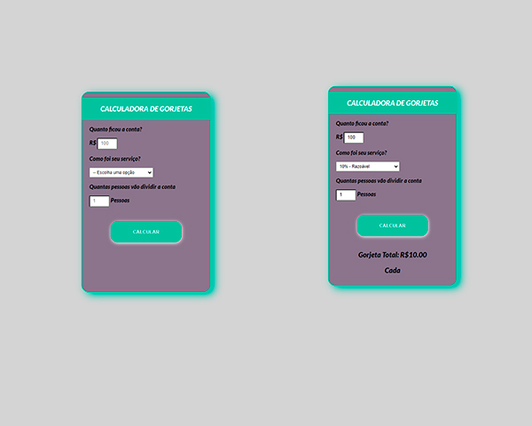

<h1 align="center"> Calculadora de Gorjetas </h1>

Desenvolvido por Gustavo Medeiros. Esse projeto foi desenolvido para aplicar conhecimentos. 

  <a href="#-tecnologias">Tecnologias</a>&nbsp;&nbsp;&nbsp;|&nbsp;&nbsp;&nbsp;
  <a href="#-projeto">Projeto</a> &nbsp;&nbsp;&nbsp;|&nbsp;&nbsp;&nbsp;
  <a href="#-layout">Layout</a> &nbsp;&nbsp;&nbsp;&nbsp;

 

## 🚀 Tecnologias

Esse projeto foi desenvolvido com as seguintes tecnologias:
- HTML e CSS
- JavaScript e JSON
- [Node e NPM](https://nodejs.org/)
- [Vite](https://vitejs.dev/)

## 💻 Projeto

Projeto desenvolvido para ser uma experiência ao usuário no qual pode calcular a gorjeta pela porcetagem e dividir a gorjeta entre as pessoas da mesa e dar uma nota para o garçom, indo de Incrivel a Precisamos melhorar. 

## 🔖 Layout

você pode visualizar cliclando nesse link a seguir: [Veja o projeto](https://calculadoragorjetas.vercel.app/)

## 🌎 Linkedin
Você pode me encontrar no Linkedin, acesse meu perfil [Linkedin](https://www.linkedin.com/in/gustavo-luiz-medeiros/)

---

Feito com ♥  Gustavo Luiz Medeiros 📱 [WhatsApp, aguardo seu contato](https://api.whatsapp.com/send?phone=5547984265359&text=)
